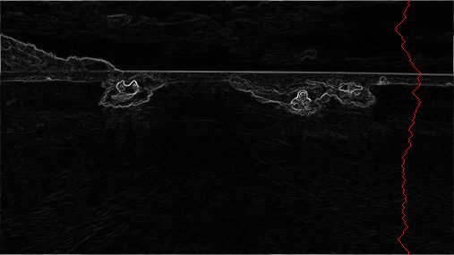

# Content Aware Image Resizer

Seam-carving is a content-aware image resizing technique where the image is reduced in size by one pixel of height (or width) at a time. A vertical seam in an image is a path of pixels connected from the top to the bottom with one pixel in each row; a horizontal seam is a path of pixels connected from the left to the right with one pixel in each column. Below left is the original 505-by-287 pixel image; below right is the result after removing 150 vertical seams, resulting in a 30% narrower image. Unlike standard content-agnostic resizing techniques (such as cropping and scaling), seam carving preserves the most interest features (aspect ratio, set of objects present, etc.) of the image.


_Input Image (1920 × 1079 pixels)_


_Ouput Image (1200 × 600 pixels)_

## Steps

1. **Energy calculation**: The first step is to calculate the energy of a pixel, which is a measure of its importance—the higher the energy, the less likely that the pixel will be included as part of a seam. The dual-gradient energy function is used.


_Dual Gradient Energy function_
The energy is high (white) for pixels in the image where there is a rapid color gradient. The seam-carving technique avoids removing such high-energy pixels.

2. **Seam identification**: The next step is to find a vertical seam of minimum total energy. (Finding a horizontal seam is analogous.) This is similar to the classic shortest path problem in an edge-weighted digraph, but there are three important differences:
   The weights are on the vertices instead of the edges.
   The goal is to find the shortest path from any of the W pixels in the top row to any of the W pixels in the bottom row.
   The digraph is acyclic, where there is a downward edge from pixel _(x, y)_ to pixels _(x − 1, y + 1), (x, y + 1), and (x + 1, y + 1)_, assuming that the coordinates are in the prescribed ranges.
   
   _Vertical Seam Representation_

3. **Seam removal**: The final step is remove from the image all of the pixels along the vertical or horizontal seam.

## Steps to run

```sh
$ pip install Pillow #pip3 install Pillow
$ python ./src/driver.py sample1.jpeg
```
